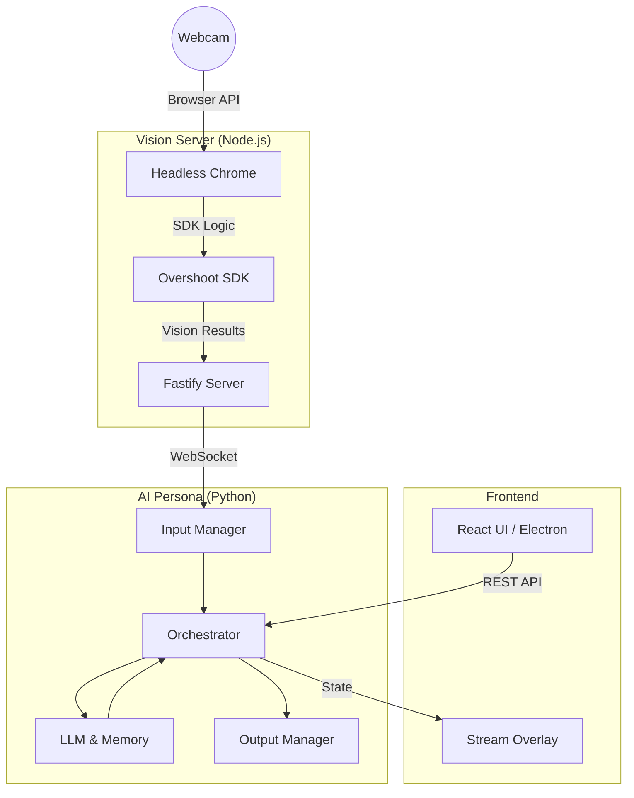

# Technical Architecture Documentation

## System Overview

The AI Persona Application is a modular system designed to run an interactive AI streaming companion. It consists of three main services working in tandem:

1.  **AI Persona Backend (Python)**: The core brain, orchestrating inputs, memory, and outputs.
2.  **Vision Server (Node.js)**: A specialized service for handling real-time video analysis using the Overshoot AI SDK running in a headless browser.
3.  **Frontend (React/Electron)**: The user interface for configuration and the overlay display.

### High-Level Architecture

---

## 1. AI Persona Backend (`src/persona`)

The Python backend is the central nervous system of the application.

### Core Components

-   **`main.py`**: Entry point. Initializes the `Orchestrator` and starts the `FastAPI` web server for the UI/Overlay.
-   **`orchestrator.py`**: Managing the `tick` loop. It gathers inputs, queries the Brain, and dispatches outputs.

### Modules

#### **Brain (`/brain`)**
Handles intelligence and state.
-   **Memory**: Long-term memory using **ChromaDB** for semantic search and retrieval of past interactions.
-   **LLM Integration**: Connects to LLM providers (e.g., Gemini, OpenAI, Anthropic) to generate responses based on context.

#### **Inputs (`/inputs`)**
Handlers for incoming data streams.
-   **Vision**: Connects to the **Vision Server** via WebSocket to receive real-time scene descriptions.
-   *(Presumed)* **Audio/Twitch**: Handlers for microphone input or Twitch chat messages.

#### **Outputs (`/outputs`)**
Handlers for acting on the world.
-   **TTS**: Text-to-Speech generation (e.g., using ElevenLabs or local models) routed to virtual audio cables.
-   *(Presumed)* **VTube/OSC**: Control signals for VTube Studio or other avatar software.

#### **Web (`/web`)**
-   **API**: FastAPI routes for the Frontend to fetch settings, status, and control the bot.
-   **Overlay**: Serves the overlay HTML/JS for OBS integration.

---

## 2. Vision Server (`vision-server`)

A dedicated Node.js service required because the Overshoot AI SDK is browser-based (WebRTC/Navigator APIs).

### Architecture
-   **Fastify**: Lightweight web server handling HTTP requests and WebSockets.
-   **Puppeteer**: Runs a headless Chrome instance to host the Overshoot SDK.
-   **`vision-client.html`**: The bridge page running inside Puppeteer. It loads the SDK from CDN and exposes global functions (`initVision`, `startVision`, `stopVision`).
-   **Communication**: 
    1.  Python Backend connects via WebSocket (`ws://localhost:3001/vision/ws`).
    2.  Fastify instructs Puppeteer via `page.evaluate()`.
    3.  Puppeteer sends results back to Fastify via `console.log` hooks.
    4.  Fastify broadcasts results to Python via WebSocket.

### Key Fixes Implemented
-   **HTTP Serving**: `vision-client.html` is served via HTTP (not `file://`) to avoid CORS/DNS resolution issues in the headless browser.
-   **Permissive Browser Flags**: Puppeteer launched with flags (`--no-sandbox`, `--disable-web-security`, etc.) to ensure reliable network and webcam access in headless environments.

---

## 3. Frontend (`frontend`)

The user facing control panel.

### Tech Stack
-   **Framework**: React + Vite
-   **Wrapper**: Electron (for desktop app capabilities)
-   **Styling**: Index.css / CSS Modules

### Features
-   **Dashboard**: Monitor bot status, recent logs/thoughts.
-   **Settings**: Configure API keys, Twitch channels, and behavior profiles.
-   **Overlay**: A transparent window/page designed to be embedded in OBS as a Browser Source.

---

## Data Flow Example: Vision

1.  **Capture**: Puppeteer (via Chrome) accesses the Webcam.
2.  **Analysis**: Overshoot SDK in the browser sends video frames to Overshoot API.
3.  **Result**: API returns a textual description (e.g., "A person holding a coffee cup").
4.  **Transport**: 
    -   Browser `console.log` -> Fastify Server (Puppeteer hook).
    -   Fastify Server -> Python Backend (WebSocket).
5.  **Cognition**: Python `InputManager` receives text -> `Orchestrator` adds to context.
6.  **Response**: `Brain` decides to comment on the coffee cup.
7.  **Output**: `OutputManager` triggers TTS to say "Nice coffee!".
